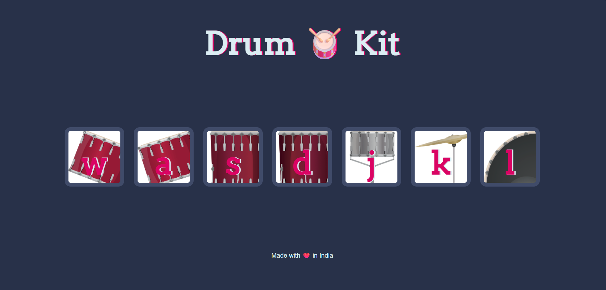

# 🥁 Drum Kit Project

A fun and interactive Drum Kit web app built using **HTML**, **CSS**, and **JavaScript**. Users can play different drum sounds by either clicking on the drum buttons or pressing corresponding keys on the keyboard.

---

## 🔥 Features

- 7 clickable drum pads with unique sounds
- Keyboard support for real-time drumming
- Smooth button animations for visual feedback
- Responsive layout
- Made with vanilla JavaScript (no libraries)

---

## 🖼️ Screenshot



---

## 🚀 How to Use

1. **Click** on any drum pad or
2. **Press** the keys: `w`, `a`, `s`, `d`, `j`, `k`, `l` on your keyboard
3. Enjoy the drum sounds and visual effects 🎶


## 🗂️ Project Structure

Drum Kit Completed/
├── index.html # Main HTML file
├── styles.css # CSS styles
├── index.js # JavaScript logic
├── sounds/ # Drum sound .mp3 files
├── images/
│ ├── tom1.png # Drum images
│ ├── ...
│ └── Screenshot.png # Screenshot image
└── README.md # This file

## 🛠️ Tech Stack
- HTML5
- CSS3
- JavaScript (ES6)

## 📦 Setup Instructions

If you want to run this locally:
```bash
git clone https://github.com/KiranKolavi01/Drum-Kit-Project.git
cd Drum-Kit-Project
open index.html in your browser


👤 Author
Kiran Kolavi
Made with ❤️ in India.


